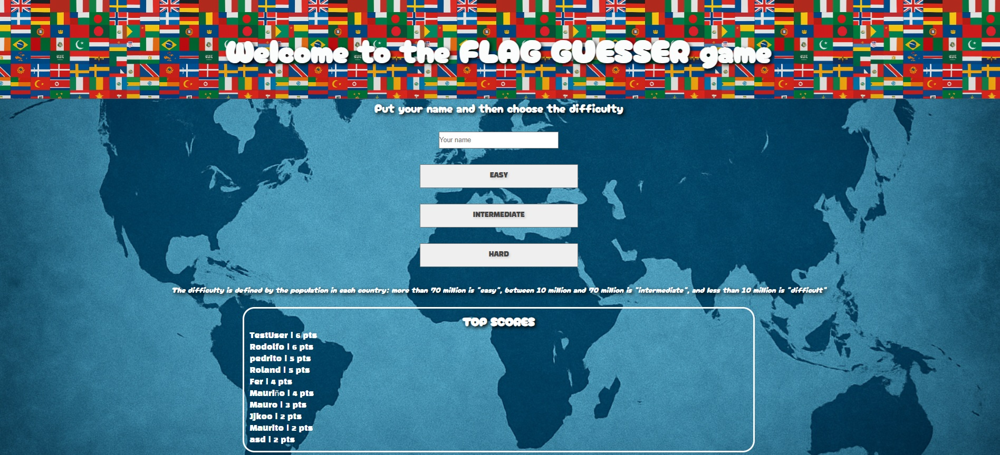
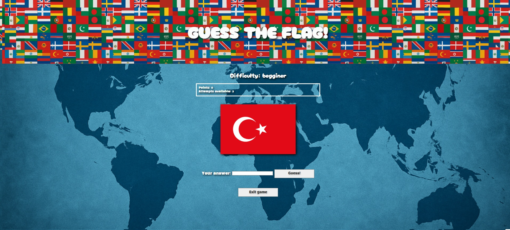
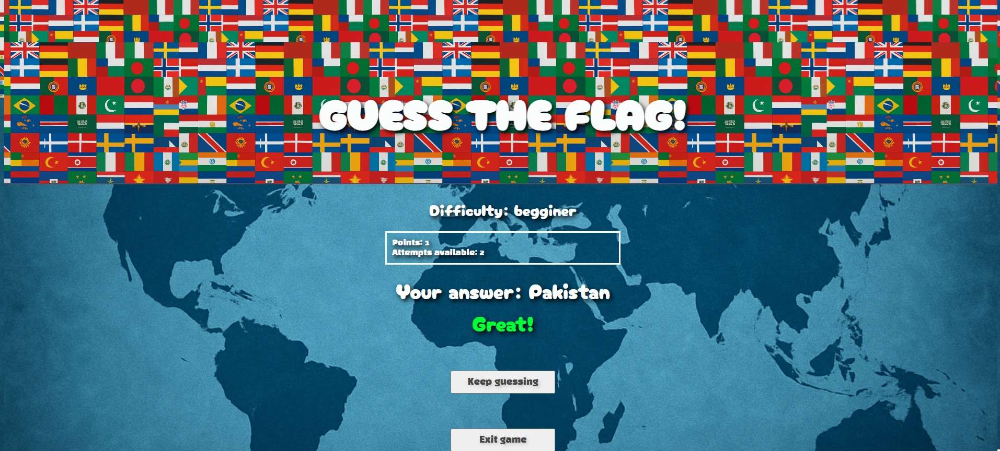
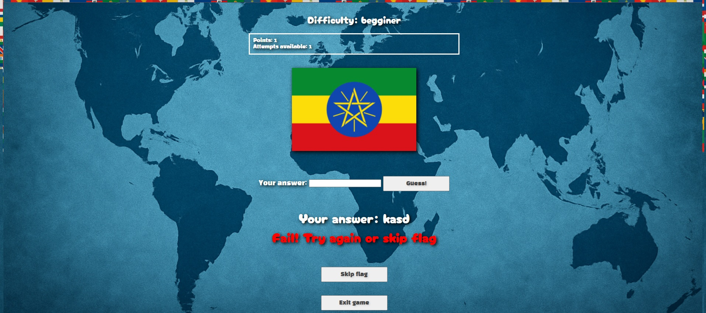
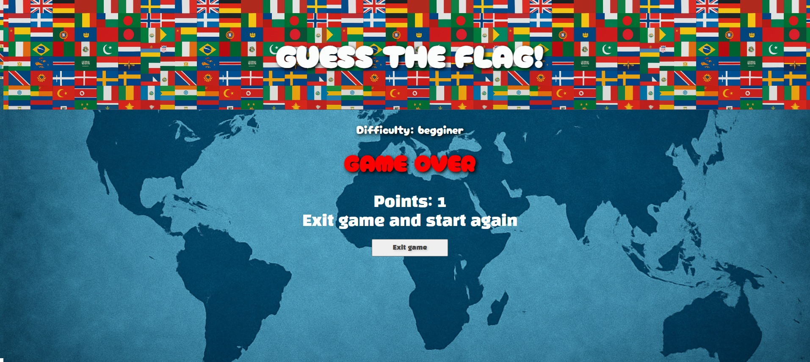

# "Guess the flag"

This is a game where the user has to guess which flag is displayed on the screen. It uses the pycountry library and the "restcountries" API: pycountry randomly selects a country, and then the API is queried using its alpha code to retrieve the image and necessary data for each country.

The game has three difficulty levels: easy, intermediate, and hard, determined by the population of each country (this was the only way to automatically separate them by difficulty).

The player has 3 attempts and earns 1 point for each correct guess. If they reach the top 10, their score is displayed on the main page. If they make a mistake, they can “refresh” the flag to see a different one if they don’t know the current one.

The application can sometimes be slow because the API is free and does not always work perfectly.

## The project uses HTML, CSS, JavaScript, and Django

## Live Demo
🔗 <a href="https://flag-guesser.onrender.com/">Click here to see the project live</a>

## Screenshots

## Author / Contact

Name: Mauro Favieri Robles

LinkedIn: http://www.linkedin.com/in/mauro-favieri-robles-a693942b0

GitHub: https://github.com/mauritoo0

Email: maurofavieri@hotmail.com

WhatsApp: +34 685 14 36 15

